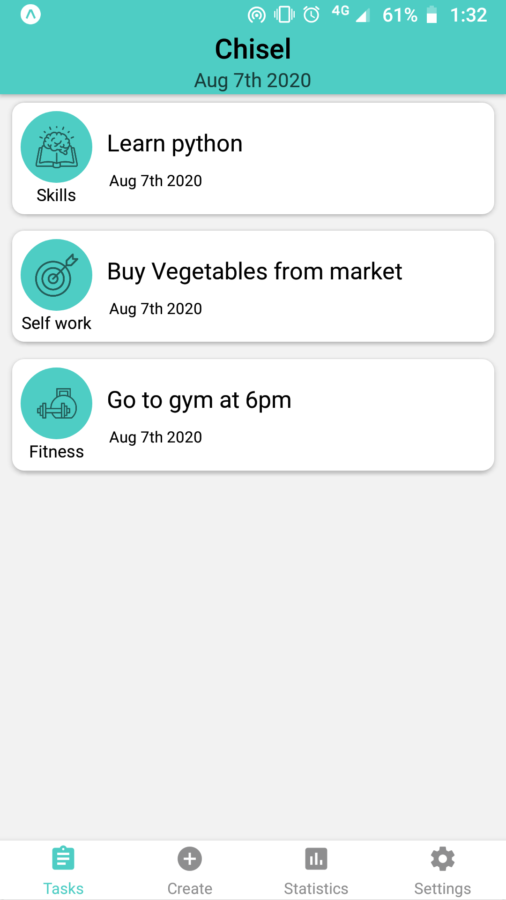
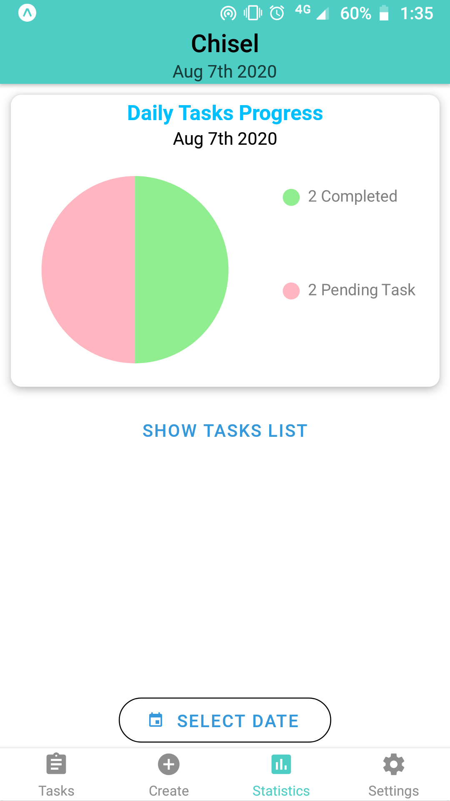

# Chisel-App

Offline Todo app, Provides statistics of all tasks created and completed.

## Dependencies

- React native
- Redux
- React Native Paper
- Async storage
- React navigation

## Preview

### Task list screen

### Create Task screen

### Update and strike Task

### Statistics screen

### List of completed and pending Tasks in Stats page

### Theme setting

## Future developments

- Adding timer functionality to each task. User can track time spent on each task
